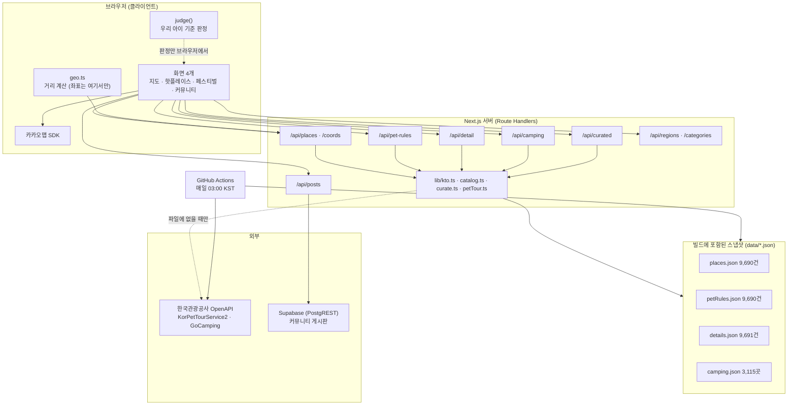
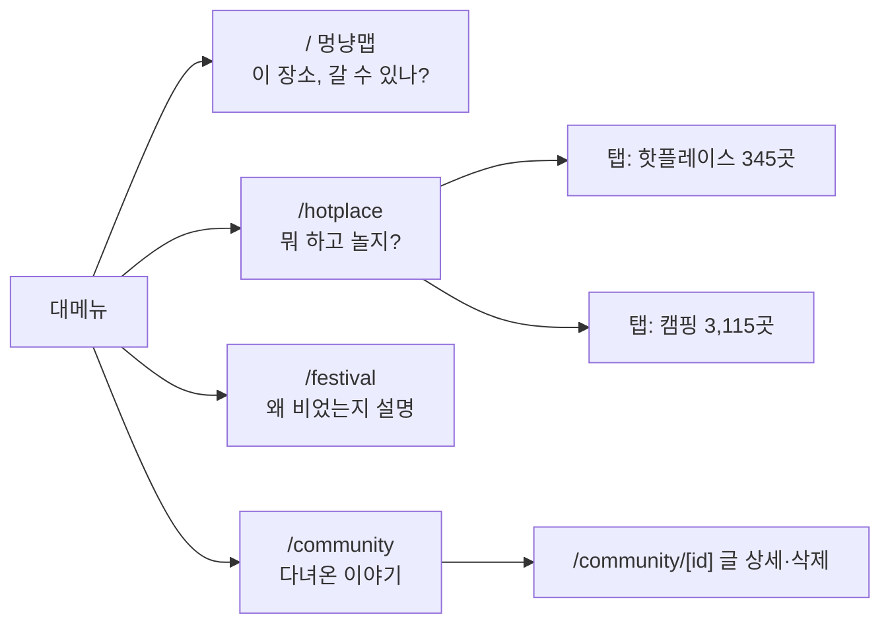
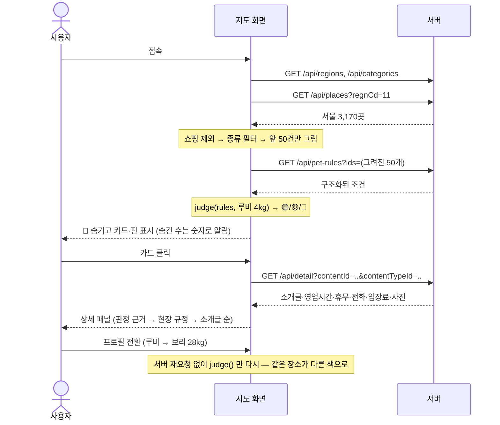
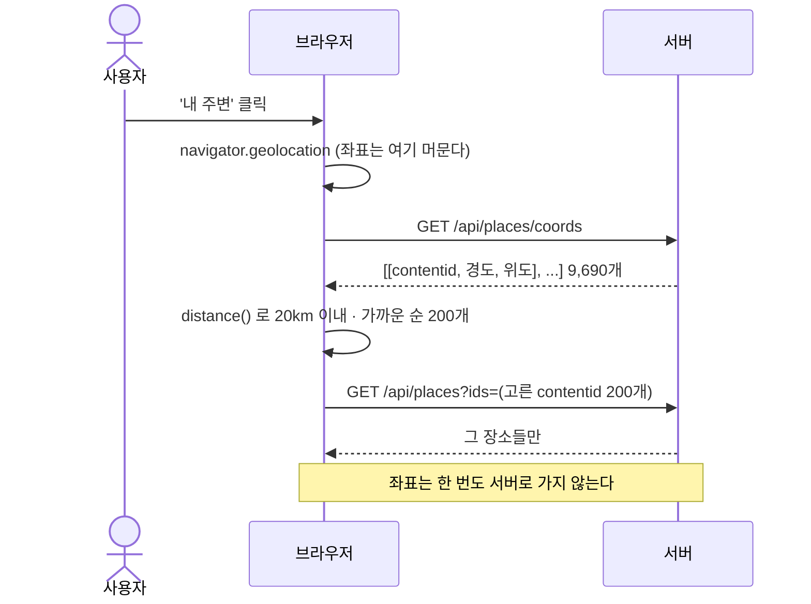
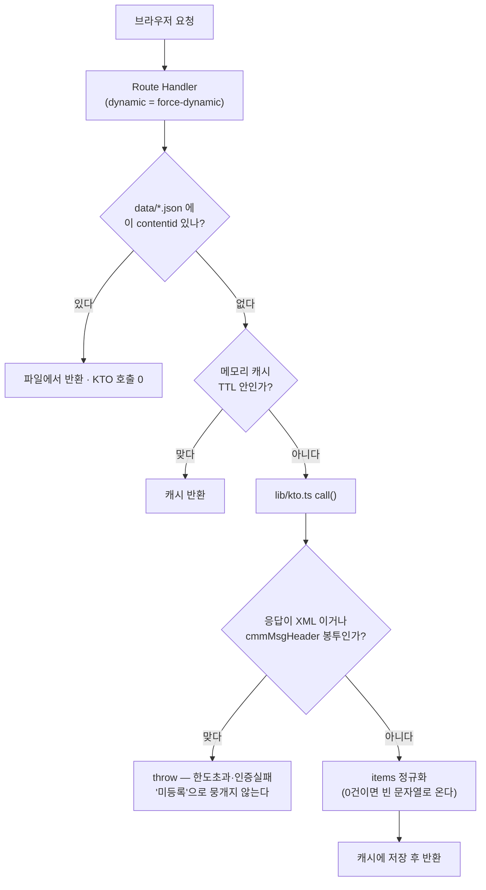
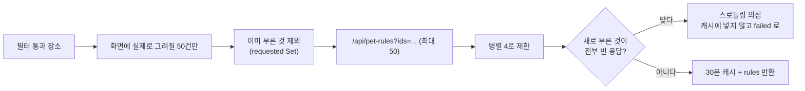
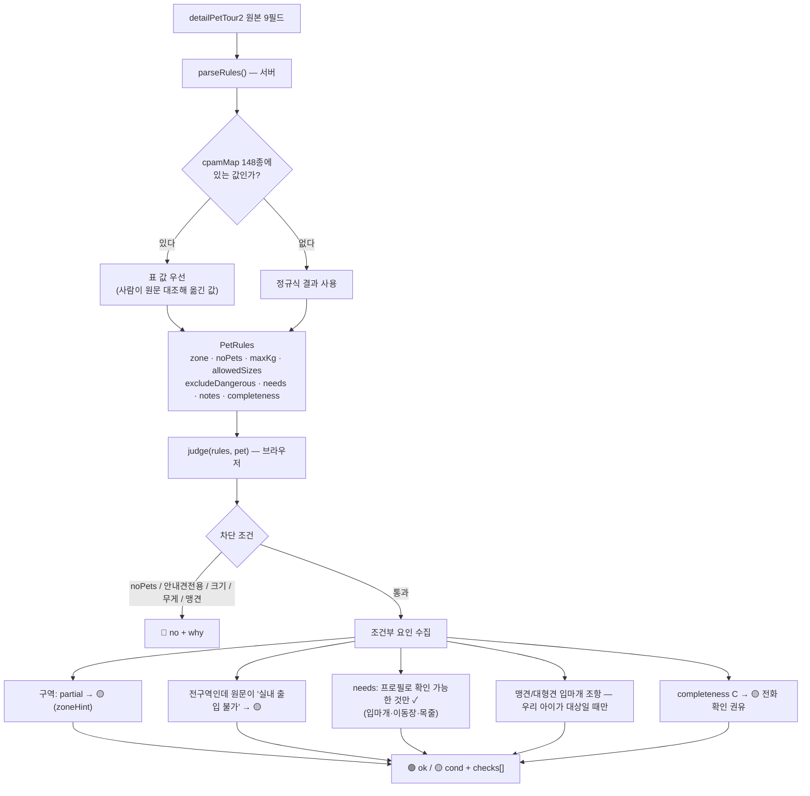
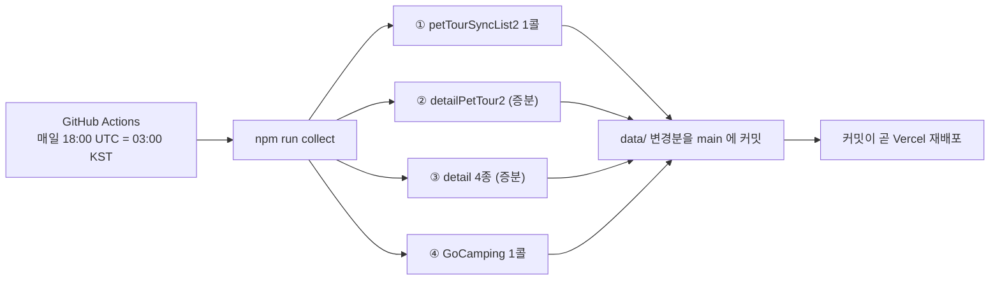

# 멍냥맵 — 전체 구조 문서

한국관광공사 반려동물 동반여행 API 로 **"우리 아이랑 여기 갈 수 있나?"** 에 답하는 웹 서비스.
2026 관광데이터 활용 공모전 웹·앱 구현 부문 지정과제 6번(모호한 반려동물 출입 조건으로
인한 현장 입장 거부·헛걸음).

이 문서는 **코드를 읽지 않고도 서비스 전체를 따라갈 수 있게** 정리한 것이다.
숫자와 예시는 전부 실측이다 — 2026-09-09 기준 `data/` 스냅샷과 로컬 서버(`:3000`)
실호출 결과에서 그대로 옮겼다. (기존 `PROJECT_STRUCTURE.md` 는 2026-09-03 시점이라
캠핑·핫플레이스·커뮤니티가 빠져 있다. 이 문서가 그것을 대체한다.)

---

## 1. 무엇을 푸는가

반려동물 동반 정보는 이미 공공데이터로 있다. 문제는 그게 **자유 텍스트**라는 것이다.

```
acmpyTypeCd    "일부구역 동반가능"
acmpyPsblCpam  "5kg 이하 동반 가능(이동장 이용 필수)"
acmpyNeedMtr   "목줄 착용,반려동물 유모차 탑승,이동장(켄넬)사용"
etcAcmpyInfo   "- 5kg이상 마라도 여객선 확인요망\n- 배변봉투 지참 및 배변처리 필수"
```

사람이 읽어도 "우리 28kg 리트리버는?" 에 바로 답이 안 나온다. 멍냥맵은 이 텍스트를
**구조화(parseRules)** 하고 **우리 아이 프로필과 대조(judge)** 해서 세 색으로 답한다.

| 판정 | 뜻 | 화면 |
|---|---|---|
| 🟢 `ok` | 조건을 다 충족 | ○ 입장 가능 |
| 🟡 `cond` | 갈 수는 있는데 확인·준비가 남음 | ✓ 조건부 가능 |
| 🔴 `no` | 못 감 | 목록·지도에서 **숨기고** 숫자로만 알림 |

원칙 하나가 전부를 지배한다 — **확인 못 한 것을 초록으로 찍지 않는다.**
헛걸음을 막으려는 서비스가 헛걸음을 만들면 안 되기 때문이다.

---

## 2. 시스템 아키텍처



핵심은 **세 층의 데이터 경로**다.

| 층 | 무엇 | 왜 |
|---|---|---|
| ① 스냅샷 파일 | `data/*.json` 을 import 해서 읽음 | 콜드스타트 0초, KTO 장애에도 서비스 생존, 호출 한도 절약 |
| ② 실시간 KTO 호출 | 파일에 없는 `contentid` 만 | 파일은 앞단일 뿐, 실시간 경로는 살아 있다 |
| ③ 메모리 캐시 | 라우트별 `Map` (TTL 30분~24시간) | 같은 화면 재렌더의 중복 호출 차단 |

파일이 **3일**보다 낡으면(`lib/catalog.ts` 의 `STALE`) 자동으로 ② 실시간 조회로 넘어간다.
배치가 멈춰도 조용히 굳지 않는다.

---

## 3. 폴더·파일 구조

### 3.1 저장소 밖 (작업 폴더)

```
관광공사/
├─ meongnyang-map/   ← 실제 서비스. git 저장소이자 코드 작업의 전부
├─ 01_공모전/          공지사항·OT자료·지정과제 원문
├─ 02_API레퍼런스/     KTO API 13개 사용법 + 공식 활용매뉴얼
├─ 03_조사기록/        API 를 직접 찔러본 기록 (probe/ 스크립트 + 실행결과)
├─ 04_산출물/          제출 문서, 운영계정 신청양식, 디자인, 구조화 CSV
├─ 05_API테스트/       .http · postman · test.sh
└─ 06_피드백사항/      받은 피드백
```

### 3.2 서비스 (`meongnyang-map/`)

| 경로 | 줄 | 역할 |
|---|---|---|
| **화면** | | |
| `app/layout.tsx` | 34 | 루트 레이아웃 · 폰트 · 대메뉴 배치 |
| `app/Nav.tsx` | 159 | 대메뉴 4개. 아이콘은 SVG(currentColor 로 활성색 추종) |
| `app/page.tsx` | 976 | **지도 화면.** 필터·목록·상세 패널·모바일 시트 전부 |
| `app/KakaoMap.tsx` | 292 | 카카오맵 래퍼. 핀 생성·범위 맞춤·리사이즈 대응 |
| `app/hotplace/page.tsx` | 409 | 핫플레이스 + 캠핑 (탭 2개) |
| `app/festival/page.tsx` | 53 | 페스티벌 — **데이터 0건인 이유를 적어 둔 화면** |
| `app/community/page.tsx` | 187 | 게시판 목록·글쓰기 |
| `app/community/[id]/page.tsx` | 105 | 글 상세·삭제 |
| **서버 라우트** | | |
| `app/api/places/route.ts` | 68 | 장소 목록 (지역·검색·ids) |
| `app/api/places/coords/route.ts` | 25 | 좌표 색인 (내 주변 전용) |
| `app/api/pet-rules/route.ts` | 102 | 동반 조건 (배치 파일 → 캐시 → 실시간) |
| `app/api/detail/route.ts` | 136 | 상세 4종 병합 |
| `app/api/camping/route.ts` | 79 | 캠핑장 (**서버에서 판정**) |
| `app/api/curated/route.ts` | 18 | 핫플레이스 / 제보 필요 목록 |
| `app/api/regions/route.ts` | 38 | 법정동 시도·시군구 |
| `app/api/categories/route.ts` | 40 | 분류체계 코드 → 이름 |
| `app/api/posts/route.ts` | 68 | 게시판 목록·작성 |
| `app/api/posts/[id]/route.ts` | 47 | 글 조회·삭제 |
| **로직** | | |
| `lib/petTour.ts` | 405 | **판정 엔진.** parseRules · judge · isDangerousBreed · sizeOf |
| `lib/cpamMap.ts` | 341 | 동반가능동물 원문 → 조건 **손수 작성한 매핑표 148종** |
| `lib/kto.ts` | 95 | KTO OpenAPI 클라이언트 (서버 전용) |
| `lib/catalog.ts` | 96 | 전국 목록 공급 (파일 ↔ 실시간 전환) |
| `lib/curate.ts` | 107 | 핫플레이스·제보필요 큐레이션 |
| `lib/camping.ts` | 106 | 캠핑 판정 · 시도명 정규화 · 태그 분해 |
| `lib/openHours.ts` | 148 | 휴무일 문장 해석 (+ 2026 공휴일표) |
| `lib/geo.ts` | 11 | 하버사인 거리 |
| `lib/pets.ts` | 20 | 반려동물 프로필(루비 4kg · 보리 28kg) |
| `lib/supabase.ts` | 44 | PostgREST 얇은 클라이언트 (service_role, **서버 전용**) |
| `lib/password.ts` | 20 | scrypt 해시 (게시글 삭제 확인용) |
| `lib/types.ts` | 118 | 타입 계약 전체 |
| `lib/useIsMobile.ts` | 21 | 화면 폭 분기 (스타일이 전부 인라인이라 상태로 처리) |
| **그 외** | | |
| `scripts/collect.mts` | 247 | **일 배치.** 4종 스냅샷 수집 |
| `scripts/seed.mts` | 265 | 게시판 시드 |
| `tests/*.test.mts` | 724 | 판정 로직 테스트 133개 |
| `.github/workflows/collect.yml` | — | 매일 03:00 KST 수집 → main 커밋 → Vercel 재배포 |
| `supabase/schema.sql` `board.sql` | — | 게시판 테이블·RLS |

---

## 4. 데이터 — 무엇이 있고 무엇이 없나

### 4.1 스냅샷 규모 (2026-09-09 수집)

| 파일 | 크기 | 건수 | 채우는 API | 콜 수 |
|---|---|---|---|---|
| `places.json` | 3.5MB | 9,690 | `petTourSyncList2` | 1콜 |
| `petRules.json` | 4.4MB | 9,690 (미등록 7) | `detailPetTour2` | 곳당 1콜 |
| `details.json` | 5.5MB | 9,691 | `detailCommon2`/`Intro2`/`Info2`/`Image2` | 곳당 4콜 |
| `camping.json` | 1.9MB | 3,115 | `GoCamping/basedList` | 1콜 |

### 4.2 콘텐츠 타입 분포 (`places.json`)

| 코드 | 종류 | 건수 | 비고 |
|---|---|---:|---|
| 38 | 쇼핑 | 8,647 | **전체의 89%.** 약국·안경원·면세점 등 개별 상점 |
| 12 | 관광지 | 760 | |
| 32 | 숙박 | 107 | 적어서 캠핑(고캠핑 3,115곳)으로 보완 |
| 28 | 레포츠 | 79 | |
| 39 | 음식점 | 72 | |
| 14 | 문화시설 | 25 | |
| 15 | 행사 | **0** | 타입 코드는 있는데 등록 데이터가 전국 0건 → 페스티벌 화면이 빈 이유 |

쇼핑이 89%라 그냥 섞으면 화면 숫자가 사실상 상점 수가 된다. 그래서 지도 기본 목록
(`갈 만한 곳`)에서 **빼고**, 칩을 누르면 보이게 옆으로 옮겼다(`app/page.tsx` 의 `ASIDE_CAT`).

### 4.3 동반 조건 충실도 (`petRules.json` 9,690건)

| 등급 | 뜻 | 건수 |
|---|---|---:|
| A | 4개 핵심 필드 모두 실질 정보 | 813 |
| B | 일부 결손 | 163 |
| C | 동반구분만 있거나 "전화문의"뿐 | 8,707 |
| null | 조건 자체가 미등록 | 7 |

| 구역 | 건수 |
|---|---:|
| `all` 전구역 동반가능 | 9,129 |
| `partial` 일부구역 동반가능 | 530 |
| `unknown` | 24 |

### 4.4 캠핑 (`camping.json` 3,115곳)

`animalCmgCl` 한 필드에 이미 구조화돼 있어 자연어 파싱이 필요 없다.

| 값 | 곳 |
|---|---:|
| 불가능 | 1,475 |
| 가능 | 672 |
| (빈값) | 512 |
| 가능(소형견) | 456 |

### 4.5 **없는 데이터** — 지어내지 않는다

방문자수 · 평점 · 리뷰 · 인기순 · 실시간 혼잡도는 이 API 에 **없다.**
그래서 핫플레이스는 "인기 순"이 아니라 *조건이 빠짐없이 등록되고(A등급) 전 구역
동반 가능하고 사진·소개글이 있는 곳*이다(현재 345곳). 문구도 그 사실만 말한다.

---

## 5. 사용자 동작 흐름

### 5.1 화면 지도



지도는 **"이 장소, 갈 수 있나?"**, 나머지는 **"뭐 하고 놀지?"** — 서로 반대 방향이라
나란히 둔다.

### 5.2 지도 화면에서 실제로 하는 일



**"내 주변"** 만 흐름이 다르다 — 규정 때문이다.



### 5.3 세 가지 답을 받는 자리

| 자리 | 무엇을 답하나 |
|---|---|
| 지도 핀 색 · 카드 배지 | 갈 수 있나 (한눈에) |
| 상세 패널 체크리스트 | **왜** 그렇게 판정했나 (원문 근거) |
| 상세 패널 "현장 규정" | 원문 그대로 (우리가 구조화하지 못한 것까지) |

---

## 6. 내부 동작 흐름

### 6.1 요청 하나가 지나는 길



`lib/kto.ts` 가 잡아내는 함정 셋:

1. 인증 실패·한도 초과가 **JSON 이 아니라 XML** 로 온다 → `<returnAuthMsg>` 를 읽어 예외.
2. 같은 오류가 **다른 JSON 봉투**(`OpenAPI_ServiceResponse.cmmMsgHeader`)로도 온다.
   놓치면 `response.body` 가 undefined → "결과 0건"으로 통과 → 화면에 **"조건 정보
   미등록"으로 잘못 표시**된다. 그래서 별도로 검사한다.
3. 결과 0건이면 `items` 가 **빈 문자열**로 온다. 단건이면 배열이 아니라 객체다.

### 6.2 동반 조건 조회 — 호출 한도가 걸린 지점

`detailPetTour2` 는 **장소당 1콜이고 벌크 조회가 없다.** 서울 3,170곳을 다 부르면
개발계정 일 1,000건을 한 번에 넘긴다. 그래서:



- **병렬 4**: 8에서 전건 빈 응답이 났고 4에서 정상이었다. 실측으로 확인된 값이다.
- **"전부 빈 응답이면 캐시하지 않는다"**: 넣으면 잘못된 판정이 30분 굳는다.
- **`failed` 와 `done: null` 은 다른 상태다.** 전자는 "못 받았다"(🔴 확인 실패),
  후자는 "받았는데 미등록"(🟡). 뭉개면 사용자가 잘못된 이유를 본다.

### 6.3 판정 파이프라인



**판정이 브라우저에서 도는 이유**: 프로필을 바꿀 때마다 서버를 다시 부르면 호출 한도를
그만큼 쓴다. 조건은 장소의 성질이고 판정은 우리 아이와의 대조이므로, 조건만 받아
브라우저에서 대조한다. (캠핑만 예외 — 아래 6.4)

### 6.4 캠핑만 서버에서 판정하는 이유

전체를 내려보내면 1.2MB 인데 **절반(1,475곳)이 아예 동반 불가라 화면에 뜨지도 않는다.**
그래서 `size` 만 받아 서버에서 거른 뒤 한 페이지(60건)만 보낸다.
크기는 판정에 필요한 값이고 개인정보가 아니다 — **위치는 여전히 받지 않는다.**

---

## 7. 내부 API 레퍼런스 (실호출 결과 포함)

전부 `GET` 이고 `dynamic = 'force-dynamic'`. 아래 응답은 2026-09-09 로컬 서버 실호출값이다.

### 7.1 `/api/regions` — 법정동 코드

`ldongCode2` 를 `lDongListYn=Y` 로 1콜. 269개 조합을 시도별로 묶어 준다. TTL 1시간.
시도 목록은 개편되므로(예: 시도 12 = 전남광주통합특별시) **하드코딩하지 않는다.**

```json
{"regions":[{"code":"11","name":"서울특별시","sigungu":[
  {"code":"110","name":"종로구"},{"code":"140","name":"중구"},{"code":"170","name":"용산구"}, ...]}]}
```

### 7.2 `/api/places` — 장소 목록

| 파라미터 | 뜻 |
|---|---|
| `regnCd` | 시도 코드 |
| `signguCd` | 시군구 코드 |
| `q` | 이름·주소 검색 (**전국에서** 찾는다. 지역까지 겹쳐 걸면 0건이 잦다) |
| `ids` | contentid 목록 — 브라우저가 거리로 고른 순서를 그대로 지킨다 |

**`lat`·`lng` 류 파라미터는 존재하지 않는다.** (§10 참고)

정렬은 타입 먼저(관광지→음식점→숙박→문화시설→레포츠→행사→쇼핑), 그다음 이름순.
이름순만 쓰면 숫자·기호로 시작하는 쇼핑이 앞을 통째로 덮는다.

```
GET /api/places?regnCd=11&signguCd=140  →  total 424
```
```json
{"contentid":"126747","contenttypeid":"12","title":"남산골한옥마을",
 "addr1":"서울특별시 중구 퇴계로34길 28 (필동2가)",
 "mapx":126.9932865315,"mapy":37.5597775194,
 "firstimage":"http://tong.visitkorea.or.kr/cms/resource/94/2932494_image2_1.bmp",
 "cat":"관광지","lclsSystm1":"HS","lclsSystm2":"HS01","lclsSystm3":"HS010600",
 "regnCd":"11","signguCd":"140"}
```

### 7.3 `/api/places/coords` — 좌표 색인

'내 주변' 전용. 전국 목록 전체(3.5MB)를 내려보내는 대신 좌표만 배열로 추린다
(객체로 담으면 키 이름이 반복돼 3배 커진다).

```
GET /api/places/coords  →  9,690개
[["2930927",129.056805686045,35.1579550616706],
 ["4012773",126.986903352805,37.5619124538241], ...]
```

### 7.4 `/api/pet-rules` — 동반 조건 ★

한 요청에 최대 50개(`MAX_IDS`), 병렬 4, TTL 30분.

```
GET /api/pet-rules?ids=126747,125496
```
```json
{"rules":{
  "126747":{
    "zone":"partial","noPets":false,"serviceDogOnly":false,
    "maxKg":null,"allowedSizes":null,"excludeDangerous":false,
    "needs":["목줄 착용"],
    "notes":["가옥 안쪽은 동반 불가","맹견의 경우, 입마개 착용 필수","배변봉투 지참 및 배변처리 필수"],
    "zoneHint":"가옥 안쪽은 동반 불가",
    "completeness":"A",
    "raw":{"contentid":"126747","acmpyTypeCd":"일부구역 동반가능",
           "acmpyPsblCpam":"전 견종 동반 가능","acmpyNeedMtr":"목줄 착용",
           "etcAcmpyInfo":"- 가옥 안쪽은 동반 불가\n- 맹견의 경우, 입마개 착용 필수\n- 배변봉투 지참 및 배변처리 필수"}
  }},
 "failed":[]}
```

`raw` 를 끝까지 들고 다니는 이유: 상세 패널이 **원문 그대로**를 보여줘야 하고,
judge 가 needs 밖의 조항(맹견 입마개 등)을 원문에서 직접 읽기 때문이다.

### 7.5 `/api/detail` — 상세 4종 병합

`detailCommon2`·`detailIntro2`·`detailInfo2`·`detailImage2` 를 **병렬로 부르고**
하나가 실패해도 나머지는 보여준다. TTL 24시간.

타입마다 필드명이 다른 것을 여기서 통일한다 — 예: 전화번호는
`12:infocenter` · `14:infocenterculture` · `39:infocenterfood`(service 가 안 붙는다) · `32:infocenterlodging`.

```
GET /api/detail?contentId=125445&contentTypeId=12   (생각하는 정원)
```
```json
{"detail":{
  "overview":"생각하는 정원은 자연 속에서 자기 자신을 만나고, 삶을 다시 돌아볼 수 있는 정원이다. …",
  "homepage":"http://www.spiritedgarden.com",
  "usetime":"09:00~18:00","restdate":"연중무휴",
  "parking":"가능 (약 소형 40대 / 대형 20대)",
  "tels":["064-772-3701"],
  "extras":[{"name":"입장료","text":"[개인]\n- 성인 15,000원\n- 청소년/경로 13,000원\n- 어린이 7,000원 …"},
            {"name":"화장실","text":"있음"}],
  "images":[{"url":"https://tong.visitkorea.or.kr/cms/resource/68/4031668_image2_1.jpg","copyright":"Type3"}, …]
 },"cached":true}
```

`copyright: "Type3"` 이미지는 **변경·크롭 금지**다(§10).

### 7.6 `/api/camping` — 캠핑장

| 파라미터 | 기본 | 뜻 |
|---|---|---|
| `size` | `small` | 우리 아이 크기 (판정용) |
| `petName` | `우리 아이` | 사유 문구에만 쓰임 |
| `do` | — | 시도 (정규화된 이름) |
| `tag` | — | 위치 유형(해변·산·숲·강·호수·섬·도심) |
| `q` | — | 이름·주소 검색 |
| `limit` | 60 (최대 200) | |

```
GET /api/camping?size=small&petName=루비&limit=1
→ total 1640, hidden 1475, okCount 1128
```
```json
{"camps":[{"id":"102032","name":"(에드203) 플라네캠핑장",
  "addr":"경기 연천군 전곡읍 양원로268번길 81","doNm":"경기도","sigunguNm":"연천군",
  "mapx":127.029586682648,"mapy":37.9697010052932,
  "lctCl":"산,숲","induty":"자동차야영장","tel":"0507-1374-0679",
  "resveCl":"전화,온라인실시간예약","animal":"가능",
  "j":{"state":"ok","why":"반려동물 동반 가능"}}],
 "regions":[{"name":"경기도","n":756},{"name":"강원특별자치도","n":559},{"name":"경상남도","n":342}, …],
 "collectedAt":"2026-09-09T06:26:41.800Z"}
```

`hidden` 은 "동반 불가라 숨긴 수"다. **숨겼다는 사실 자체는 숫자로 알린다.**
시도명은 개편 전후가 한 데이터에 섞여 있어(강원도 341 + 강원특별자치도 218) 최신 명칭으로
모은다 — 안 그러면 '강원특별자치도'를 고른 사람이 341곳을 못 본다.

### 7.7 `/api/curated` — 큐레이션 (KTO 호출 0)

배치 파일 셋(`places`·`petRules`·`details`)을 엮기만 한다.

| `kind` | 기준 | 현재 |
|---|---|---:|
| `hotplace` | A등급 **AND** 전구역 **AND** 사진 있음 **AND** 소개글 있음 | 345곳 |
| `needs` | 조건 정보가 부족해 판정을 못 해주는 곳 | 8,714곳 |

```json
{"contentid":"2024432","title":"가우도","cat":"관광지",
 "addr1":"전남광주통합특별시 강진군 도암면 신기리 산31-2",
 "reasons":["전 구역 동반 가능","조건 정보 완전","연중무휴","목줄만 있으면 됨"],
 "needs":["목줄 착용"],"usetime":"상시 개방","restdate":"연중무휴"}
```

`reasons` 는 **왜 이 목록에 올랐는지**다 — 근거 없이 추천하지 않는다.
`needs`(제보 필요) 쪽은 반대로 `missing` 에 무엇이 비었는지 적는다:
`["어떤 아이가 가능한지","무엇을 챙겨야 하는지","현장 규정"]`.

### 7.8 `/api/categories` — 분류체계 이름표

`areaBasedList2` 계열이 `lclsSystm1/2/3` 을 코드로만 주므로 이름을 따로 받는다.
1depth 1콜 + 그 수만큼의 2depth 콜 → 하루 캐싱. 현재 69종.
실패해도 화면은 동작한다(코드를 그대로 보여주면 된다).

```json
{"names":{"HS":"역사관광","HS01":"역사유적지","NA":"자연관광","SH":"쇼핑","SH04":"면세점", …}}
```

### 7.9 `/api/posts`, `/api/posts/[id]` — 커뮤니티

Supabase(PostgREST)만 쓰고 KTO 는 안 부른다. 로그인이 없어 **닉네임 + 비밀번호**로 쓴다.

| 메서드 | 경로 | 동작 |
|---|---|---|
| GET | `/api/posts?page=1` | 최신순 20건. 삭제된 글 제외 |
| POST | `/api/posts` | 작성 (닉네임 1~20 · 제목 1~80 · 본문 1~4000 · 비밀번호 4자 이상) |
| GET | `/api/posts/[id]` | 글 하나 + 조회수 +1 (조회수 실패해도 글은 보여준다) |
| DELETE | `/api/posts/[id]` | 비밀번호 대조 후 **soft delete**(`deleted_at` 표시만) |

```json
{"posts":[{"id":2,"nickname":"Young","title":"First posting","views":3,"created_at":"2026-09-05T10:00:15.789708+00:00"},
          {"id":1,"nickname":"초코아빠","title":"낙산공원 다녀왔어요","views":7,"created_at":"2026-09-04T10:15:02.417144+00:00"}],
 "page":1,"hasMore":false}
```

비밀번호는 `scrypt(salt)` 해시로만 저장하고 비교는 `timingSafeEqual` 로 한다.
환경변수가 없으면 `{"posts":[],"offline":true}` 로 응답해 화면이 깨지지 않는다.

---

## 8. 외부 API — 무엇을 어디에 쓰나

### 8.1 한국관광공사 `KorPetTourService2`

기본 URL `https://apis.data.go.kr/B551011/KorPetTourService2/`

| 오퍼레이션 | 쓰는 곳 | 콜 단위 | 비고 |
|---|---|---|---|
| `petTourSyncList2` | `lib/catalog.ts` · 배치 | 전국 1콜 | 응답 8.9MB. Next 데이터 캐시 상한 2MB 초과라 **캐시 안 씀** |
| `detailPetTour2` | `/api/pet-rules` · 배치 | **장소당 1콜** | 벌크 없음 — 호출 한도의 핵심 |
| `detailCommon2` | `/api/detail` · 배치 | 장소당 1콜 | 소개글·홈페이지 |
| `detailIntro2` | `/api/detail` · 배치 | 장소당 1콜 | 영업시간·휴무·전화·주차 (전화는 **여기에만** 있다) |
| `detailInfo2` | `/api/detail` · 배치 | 장소당 1콜 | 입장료·시설 안내 |
| `detailImage2` | `/api/detail` · 배치 | 장소당 1콜 | 추가 사진 (`cpyrhtDivCd` Type3 = 변경 금지) |
| `ldongCode2` | `/api/regions` | 1콜 | 269개 조합 |
| `lclsSystmCode2` | `/api/categories` | 1 + N콜 | 분류체계 이름 |
| `locationBasedList2` | **쓰지 않는다** | — | 좌표 기반 검색 = 위치 전송이라 §10 위반 |

**`detailPetTour2` 원본 9필드와 실측 채움률**(417건 표본)

| 필드 | 뜻 | 채움률 | 판정에 쓰나 |
|---|---|---:|---|
| `acmpyTypeCd` | 동반구분 | 97% | ✅ zone (값은 "전구역/일부구역 동반가능" 2종뿐) |
| `acmpyPsblCpam` | 동반가능동물 | 57% | ✅ 무게·크기·맹견·안내견 (자유 텍스트 148종) |
| `acmpyNeedMtr` | 동반시 필요사항 | 52% | ✅ needs (콤마 구분, 이미 구조화됨) |
| `etcAcmpyInfo` | 기타 동반정보 | 51% | ✅ notes · zoneHint · 맹견 입마개 조항 |
| `relaAcdntRiskMtr` 외 5필드 | 사고대비·구비시설·비치/렌탈/판매품목 | 0~11% | ❌ 쓰지 않는다 |

**원본 응답 예시** (`03_조사기록/probe/pettour_sample.json` 에서 그대로)

```json
{"contentid":"126078","relaAcdntRiskMtr":"전 견종 동반 가능",
 "acmpyTypeCd":"일부구역 동반가능","relaPosesFclty":"","relaFrnshPrdlst":"",
 "etcAcmpyInfo":"- 맹견의 경우, 입마개 착용 필수- 배변봉투 지참 및 배변처리 필수",
 "relaPurcPrdlst":"","acmpyPsblCpam":"전 견종 동반 가능",
 "relaRntlPrdlst":"","acmpyNeedMtr":"목줄 착용"}     // 광안리해수욕장
```

`etcAcmpyInfo` 를 보면 **개행 없이 `- ` 만으로 항목이 이어진다.** 그래서 `splitNotes()` 가
글머리표 유무를 보고 나눈다. 글머리표를 쓰는 원문에서만 "글머리표 없는 줄 = 앞 항목의
이어짐"이 성립하고, 아예 없으면 개행 자체가 구분자다(경주읍성·선실 객실 사례).

### 8.2 `GoCamping` (고캠핑)

`basedList` 1콜로 전국 3,115곳. 한 곳당 81필드지만 화면이 쓰는 21필드만 남긴다.
동반 여부가 `animalCmgCl` 에 이미 '가능 / 가능(소형견) / 불가능 / 빈값' 으로 들어 있어
자연어 파싱이 필요 없다.

### 8.3 그 외

| 대상 | 용도 | 키 |
|---|---|---|
| 카카오맵 JS SDK | 지도·핀 | `NEXT_PUBLIC_KAKAO_MAP_KEY` — **클라이언트로 나가는 유일한 키** |
| Supabase PostgREST | 커뮤니티 | `SUPABASE_SERVICE_ROLE_KEY` — RLS 우회 키라 **절대 브라우저로 나가면 안 됨** |
| Google Fonts | IBM Plex Sans KR · Jua | — |

---

## 9. 판정 엔진 상세 + 실제 판정 사례

### 9.1 `parseRules()` — 자연어 → 구조

정규식과 **손수 만든 매핑표**를 함께 쓴다.

- `lib/cpamMap.ts` 는 `acmpyPsblCpam` 실데이터 **148종 전부**를 사람이 원문과 대조해 옮긴 표다.
  두 명이 독립적으로 확인해 동의한 것만 남겼다.
- 표에 있으면 표가 이긴다(정확도). 표에 없는 새 값은 정규식이 받는다(미지의 값).
- **`false` 는 표에 적지 않고 생략한다.** `excludeDangerous: false` 를 박으면
  기타정보에 적힌 맹견 배제까지 덮어쓰기 때문이다.
- 나이·체고·마리수·계절처럼 구조로 못 옮기는 조건은 억지로 필드에 넣지 않고
  `needsAttention` + `note` 로 남겨 **화면에서 직접 확인을 권한다.**

특히 조심한 오탐들:

| 원문 | 순진한 처리 | 실제 처리 |
|---|---|---|
| `맹견 동반 불가` | 전면 금지(🔴) | 맹견만 배제. 다른 아이는 갈 수 있다 |
| `전 견종 출입 가능(맹견의 경우, 입마개 착용 필수)` | 맹견 배제 | 조건부 허용 |
| `대형견 4~5마리까지 가능` | 대형견 배제 | 허용 서술 |
| `안내견도 가능` | 안내견 전용(🔴) | 다른 개를 받는 표현이 있으면 전용 아님 |
| `8kg 미만` | 8kg 이하로 처리 | **경계 배타** — 정확히 8kg 은 불가 |
| `제외15Kg이하`, `9㎏ 이하` | 매칭 실패 | 대문자·합자·공백 없는 표기 모두 흡수 |
| `배변봉투 지참… 시설 내` | '시설' 두 글자로 구역 힌트 오인 | 막힌 곳을 콕 집은 문장을 먼저 고른다 |
| 필요사항의 `기타`, `자유이용` | 준비물로 표시 | 준비물이 아니라 라벨·정책값 — 걸러낸다 |
| 동반가능동물이 `전화문의` 뿐 | 값이 있으니 A등급 | **C등급** — 단정할 근거가 없다 |

### 9.2 `judge()` — 실제 출력

같은 장소를 **루비(요크셔테리어 4kg, 이동장 O, 입마개 X)** 와
**보리(리트리버 28kg, 이동장 X, 입마개 O)** 로 각각 판정한 실제 결과다.

**① 남산골한옥마을 (126747)** — 전 견종 가능이지만 일부 구역 제한

```
루비 → cond  ! 가옥 안쪽은 동반 불가   ✓ 목줄 착용
보리 → cond  ! 가옥 안쪽은 동반 불가   ✓ 목줄 착용
```
`zoneHint` 가 원문에서 나왔기 때문에 "일부 구역만 가능"이라는 막연한 경고 대신
**어디가 막혔는지**를 그대로 보여준다.

**② 마라도 (126450)** — `acmpyPsblCpam: "5kg 이하 동반 가능(이동장 이용 필수)"`

```
루비 → cond  ✓ 5kg 이하 → 4kg 충족
             ! 일부 구역만 동반 가능 — 공개된 구역 정보가 없어요
             ✓ 목줄 착용
             ! 반려동물 유모차 탑승 — 준비 확인 필요
             ✓ 이동장(켄넬)사용 → 보유 중
보리 → no    why: "5kg 이하 반려동물만 가능 (보리 28kg)"
```
유모차는 프로필에 없는 준비물이라 **초록 ✓ 를 주지 않는다.** 확인 못 한 것을 ✓ 로 찍으면
"이미 갖췄다"로 읽혀 준비 없이 출발하게 된다.

**③ 용두연유원지 (126141)** — 동반구분만 등록된 C등급

```
루비/보리 → cond  ! 일부 구역만 동반 가능 — 공개된 구역 정보가 없어요
                  ! 등록된 조건 정보가 적어요 — 방문 전 전화 확인을 권해요
```
근거가 하나도 안 쌓인 경우는 "제한이 없다"가 아니라 **"아무것도 확인 못 했다"** 다.
그래서 초록이 아니라 노랑이다.

**④ 재인폭포 (125496)** — 원문 그대로가 답인 사례

```
zoneHint: "전기차량 동반 불가(도보로만 이동 가능)"
```
우리가 요약하는 것보다 원문이 정확하다.

### 9.3 맹견 판정

동물보호법 시행규칙 [별표 2] 5종(도사견·아메리칸 핏불테리어·아메리칸 스태퍼드셔 테리어·
스태퍼드셔 불테리어·로트와일러)을 견종 자유입력에서 잡아낸다. 한글/영문/표기 흔들림
(`로트바일러`, `AmStaff`, `Staffy`, `스태포드셔`)을 흡수하되,
**`bull` 단독은 절대 넣지 않는다** — 불독·불테리어·불마스티프가 통째로 걸린다.

### 9.4 휴무일 (`lib/openHours.ts`)

"오늘 영업 중"이라고 **단정하지 않는다.** 틀린 '영업 중'이 곧 헛걸음이기 때문이다.

| 판정 | 조건 |
|---|---|
| `always` | "연중무휴" — 단, 괄호에 휴무일이 함께 적혀 있으면 `unknown` |
| `closed` | "매주 월요일" 류가 오늘과 일치 |
| `maybe` | 일치하지만 "단, 공휴일이면 개관" 예외가 붙음 (2026 공휴일표로 대조) |
| `unknown` | 규칙을 못 읽음 → **원문을 그대로 보여준다** |

"매월 첫째 수요일"처럼 몇째 주가 붙은 것은 매주가 아니므로 제외한다.

---

## 10. 지켜야 할 제약 넷

이 넷은 코드만 봐서는 알 수 없고, 어겼을 때 되돌리기 어렵다.

### ① 사용자 위치를 서버로 보내지 않는다

좌표를 **전송**하는 순간 저장 여부와 무관하게 위치기반서비스사업자 신고 대상이 된다
(공모전 공지 FAQ). 신고 없이 운영하면 실격이다.

- `/api/places` 에 `lat`·`lng` 류 파라미터를 **추가하지 말 것**
- 지도 API 의 `locationBasedList2`(좌표 기반 검색)도 같은 이유로 쓰지 않는다
- 우회 구조: `/api/places/coords` 색인 → 브라우저 `distance()` → 고른 `contentid` 만 되묻기

### ② 없는 데이터를 지어내지 않는다

방문자수·평점·리뷰·"인기 급상승"은 이 API 에 없다. 화면에도 문서에도 넣지 않는다.
페스티벌은 전국 0건이라 **왜 비었는지를 화면에 적어 둔다**(더미 데이터 금지).
판정 근거는 원문에서 나온 것만 쓴다.

### ③ 출처 ⓒ한국관광공사 표기

데이터를 보여주는 화면마다 붙어 있어야 한다. 공모전 필수 조건이고, 레이아웃을 정리하다
지우기 쉬운 자리에 있다. `detailImage2` 의 **Type3 이미지는 변경·크롭 금지.**

### ④ 브랜치

`feature/kim` · `feature/gu` 로 나눠 쓰고 **main 에 직접 푸시하지 않는다.**
합치는 건 GitHub PR. main 따라잡기는 `git pull --rebase origin main`.
`data/*.json` 은 배치가 매일 main 에 커밋하므로 충돌 시
`git checkout origin/main -- data/` 로 main 것을 취한다.

---

## 11. 배치·배포



- **증분**이다. 이미 받은 `contentid` 는 건너뛰므로, 다 채운 뒤로는 새 장소가 생겼을 때만 바뀐다.
- 일일 한도(`LIMITED_NUMBER_OF_SERVICE_REQUESTS`)에 걸리면 **받은 데까지 저장하고 멈춘다.**
  다음 날 실행이 이어서 받는다.
- 개발계정 일 1,000건 → 2026-09-08 **운영계정 승인으로 일 100,000건**. 그래서 지금은
  쇼핑 8,647건까지 전 타입을 한 번에 받는다.
- 배포 환경은 파일시스템이 읽기 전용이라 런타임 캐시를 파일로 못 쓴다. **빌드에 포함된
  파일을 읽는 것**은 어디서든 동작하므로 수집 결과를 커밋한다.
- 배치가 멈추면 3일 뒤부터 서버가 실시간 조회로 전환된다(`lib/catalog.ts`).

**환경변수**

| 이름 | 쓰는 곳 | 노출 |
|---|---|---|
| `KTO_SERVICE_KEY` | 서버 라우트·배치 | 서버 전용 (URL 인코딩된 키를 디코딩해서 사용) |
| `KTO_MOBILE_APP` | KTO 호출 헤더 | 서버 전용 |
| `SUPABASE_URL` / `SUPABASE_SERVICE_ROLE_KEY` | 커뮤니티 | 서버 전용 |
| `NEXT_PUBLIC_KAKAO_MAP_KEY` | 지도 | **클라이언트** |

---

## 12. 테스트

```bash
npm test        # 133개 통과 (2026-09-09 확인)
```

| 파일 | 무엇 |
|---|---|
| `tests/parseRules.test.mts` | 자연어 → 구조 변환 |
| `tests/judge.test.mts` | 프로필 대조 판정 |
| `tests/openHours.test.mts` | 휴무일 해석 |
| `tests/integration.test.mts` | parseRules → judge 통합 |

케이스를 지어내지 않았다 — **실측 코퍼스**(동반가능동물 149종·필요사항 28종·
기타정보 60종·휴무일 42종)에서 뽑았고, 기대값은 두 검증자가 각각 계산해 동의한 것만 남겼다.
이견이 있던 11건은 뺐다.

판정 실패는 곧 사용자 피해다:

```
🔴 못 가는데 '입장 가능'  → 헛걸음. 이 서비스의 존재 이유가 무너진다
🟡 갈 수 있는데 '불가'    → 기회 손실. 사용자는 틀렸다는 걸 영영 모른다
```

---

## 13. 알려진 제약·미해결

| 항목 | 상태 |
|---|---|
| 페스티벌 | 데이터 0건. 화면에 이유를 적어 둔 상태 |
| 반려동물 프로필 | 하드코딩 2마리(루비·보리). 사용자 입력 미구현 |
| `petRules.json` 과 현재 파서 불일치 | **9,683건 중 53건.** 스냅샷이 파서 수정 이전에 수집됨 (maxKg 19 · excludeDangerous 14 · completeness 14 · serviceDogOnly 5 · noPets 2). `data/petRules.json` 을 지우고 재수집하면 해소된다 |
| 캠핑 기능 | `feature/kim` 에서 작업 중 (미커밋) |
| 공휴일표 | 2026년만. 연도가 늘면 한국천문연구원 특일정보 API 로 대체하는 게 맞다 |

---

*데이터 출처: ⓒ한국관광공사 · 문서 기준일 2026-09-09*
