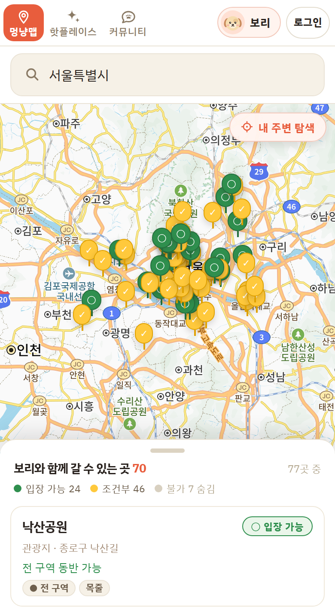

# 멍냥맵

**"우리 아이랑 여기 갈 수 있나?"** 에 🟢 입장 가능 · 🟡 조건부 · 🔴 불가 로 답한다.
한국관광공사가 자연어로만 내려주는 반려동물 동반 조건을 우리 아이 프로필(체중·맹견 여부·준비물)과 대조해,
현장에서 입장을 거부당하는 헛걸음을 막는다.

2026 관광데이터 활용 공모전 웹·앱 구현 부문 · 지정과제 6번.

**배포 → https://meongnyangmap.vercel.app** · 출처: ⓒ한국관광공사

<p>
  
  
  
</p>

> 같은 롯데월드타워도 7kg 보리에게는 **조건부**(소형견 충족 · 이동장 미보유), 28kg 태풍에게는 **불가**다.
> 판정의 근거는 전부 공사 원문에서 나온다.

| | |
|---|---|
| 데이터 | 전국 **9,682곳** · 동반 조건 **9,690건** · 캠핑장 3,118곳 — 매일 03:00 KST 자동 갱신 |
| 판정 엔진 | 자연어 조건 파서 + 판정기 · **테스트 146개 전부 통과** (실측 코퍼스에서 뽑은 케이스) |
| 관광공사 API | 4개 서비스 · 11개 오퍼레이션 — 실제로 호출하는 것만 [아래](#사용-api)에 적었다 |
| 개발 | 2026-08-29 시작 · Claude 와 페어로 작업 ([어떻게](#ai-와-함께-만든-방식)) |

---

## 문제를 다시 정의했다

처음 기획은 **반려동물 동반 카페·식당 지도**였다. 코드를 쓰기 전에 API 를 438번 직접 호출해
데이터가 그 기획을 받쳐주는지부터 쟀다 (2026-08-29, 오류 0건).

| 쟀더니 | 그래서 |
|---|---|
| 전체 9,693건 중 **8,647건(89%)이 쇼핑** — 약국·안경원·의원 같은 일반 관광 쇼핑 DB 가 섞여 들어와 있고, 동반 조건 필드는 비어 있다 | 쇼핑은 조건 판정 대상에서 뺀다 |
| **음식점은 72건뿐**, 그중 조건이 적힌 곳은 약 31% | 카페·식당 지도는 데이터로 성립하지 않는다 → 기획 폐기 |
| 조건은 `"5kg 이하 동반 가능(이동장 이용 필수)"` 같은 **자연어** 로 온다 | 이 모호함이 지정과제 6번이 말하는 헛걸음의 원인이다 → **판정**을 서비스의 중심에 둔다 |

"어디에 있나"를 보여주는 지도가 아니라 **"우리 아이가 갈 수 있나"를 답하는 판정기**로 방향을 바꿨다.

---

## AI 와 함께 만든 방식

사람 커밋 126개 중 124개가 Claude 와 공동 작성이다 (2026-09-25 기준). 역할은 이렇게 나눴다.

| 사람이 정한 것 | AI 가 한 것 |
|---|---|
| 무엇을 만들지 — 위 실측 결과를 보고 카페 지도를 버린 결정 | 실측 스크립트 작성과 결과 집계 |
| 되돌리기 어려운 규칙 4개 ([CLAUDE.md](CLAUDE.md)) | 규칙 안에서의 구현, 리팩터링, 문서 |
| 판정이 틀렸을 때 어느 쪽 피해를 더 무겁게 볼지 | 148종 원문 매핑, 실측 코퍼스에서 테스트 케이스 추출 |
| 예시 프로필 제거 같은 제품 판단 ([5e8e71f][5e8e71f]) | 리뷰 — 보안·정확성·규칙 관점 |

### 1. 규칙은 "코드를 읽어서는 알 수 없는 것"만 적는다

[CLAUDE.md](CLAUDE.md) 에는 네 가지뿐이다. 어기면 되돌리기 어렵고, 코드만 봐서는 모르는 것들이다.

- **위치를 서버로 보내지 않는다** — 좌표를 전송하는 순간 위치기반서비스사업자 신고 대상이다. '내 주변'은 좌표 색인만 받아 브라우저에서 거리를 잰다.
- **없는 데이터를 지어내지 않는다** — 방문자수·평점·"인기 급상승"은 이 API 에 없다. 그럴듯하게 채우지 않는다.
- **출처 표기** — 공모전 필수 조건. 레이아웃을 정리하다 지우기 쉬운 자리에 있다.
- **브랜치 규칙** — 동료와 함께 쓰기 시작한 뒤로.

### 2. 정답은 서로 모르는 두 세션이 합의한 것만 남긴다

판정 엔진의 기대값과 동반가능동물 148종 매핑표는 **독립된 AI 세션 두 개**가 각자 원문을 따라가 계산한 뒤,
둘이 일치한 것만 채택했다. 한쪽은 정규식과 분기를 손으로 실행했고, 다른 쪽은 "이 값이 맞다면 누가 헛걸음을 하게 되는가"를 따졌다.
**이견이 난 11건은 테스트에 넣지 않았다.** → [tests/README.md](tests/README.md)

### 3. 리뷰는 관점을 쪼개서 여러 에이전트에게 맡긴다

사진·리뷰 기능을 붙인 뒤 보안·정확성·규칙 관점의 에이전트 18개로 리뷰했고, 기능 테스트로는 드러나지 않던 것들이 나왔다 ([0d029dc][0d029dc]).

- 줄이지 못한 원본 사진(HEIC 등)을 그대로 올리면 **촬영 위치(EXIF GPS)가 공개 버킷에 남는다** → 원본 업로드 금지, 캔버스로 다시 그려 메타데이터 제거
- 사진 URL 을 접두사로만 검사해 **뒤에 4MB 를 붙이면 목록 응답이 터진다** → 정확한 모양만 허용
- 늦게 도착한 응답이 최신 화면을 덮어쓴다 → 마지막 요청만 반영

### 4. 실데이터를 돌려서 AI 도, 원천 데이터도 틀린 걸 잡았다

| 무엇이 틀렸나 | 어떻게 드러났나 | 고친 것 |
|---|---|---|
| 대문자 `8KG` 를 못 읽어 **28kg 개가 8kg 제한 숙소에 🟢** | 실측 코퍼스 149종으로 만든 테스트 | 148종 매핑표 + 정규식 보강 ([3eb5c3b][3eb5c3b]) |
| `'불가(보조견만 가능)'` 이 🟡 조건부로 통과 · `'맹견 동반 불가'` 가 일반견까지 🔴 차단 | 같은 테스트 | 같은 커밋 |
| 일일 한도 초과 응답이 JSON 으로도 오는데 XML 만 검사 → **모든 장소가 "조건 정보 없음"으로 둔갑** | 한도에 걸린 날의 화면 | 두 봉투 모두 예외 처리, 실패 0 → 78건이 오류로 드러남 ([5b94006][5b94006]) |
| 병렬 8로 부르면 오류 대신 **200 + 빈 결과**로 스로틀링 — 서울 78건 전부 빈 응답 | 지역별 건수 대조 | 병렬 4 · 서울 78/78, 부산 39/39, 경기 125/125 ([9ca0171][9ca0171]) |
| 스냅샷에 `maxKgInclusive` 가 없어 **"10kg 미만"을 "이하"로** 읽음 — 정확히 10kg 인 아이가 🟢 | 전량 재수집 | 재수집으로 8,731건에 키가 들어옴 ([4bd5a13][4bd5a13]) |
| 파서가 좋아진 만큼 전국이 "조건 바뀜"으로 찍힘 (첫 실행 141곳, 원문은 동일) | 이전 스냅샷과 원문 4필드 대조 | 파싱 결과가 아니라 **원문**끼리 비교 ([75ad3af][75ad3af]) |
| 원천 데이터의 '사고 위험 요소' 545곳 중 **394곳이 엉뚱한 내용** | 화면에 "⚠ 사고 위험 요소: 전 견종 동반 가능"이 뜸 | 필드 이름이 아니라 내용으로 이름표를 고른다 ([03dc3ca][03dc3ca]) |
| 호출 기록 저장이 실패하면 페이로드가 **O(N²)** 로 증가 (1,200콜 재현: POST 701회) | 리뷰 + 재현 | 500행 단위 전송 · 재시도 간격 → 같은 재현에서 POST 3회 ([2fd84d6][2fd84d6]) |

성능도 잰 뒤에 고쳤다 — 목록을 서버에서 걸러 서울 기본 화면 **1,008KB → 24KB**, 전국 검색 **3MB → 12KB** ([c133162][c133162]).

---

## 판정 엔진

`detailPetTour2` 가 주는 조건은 코드가 아니라 **자연어 문장**이다.

```
acmpyTypeCd    "일부구역 동반가능"
acmpyPsblCpam  "5kg 이하 동반 가능(이동장 이용 필수)"
acmpyNeedMtr   "목줄 착용,반려동물 유모차 탑승,이동장(켄넬)사용"
```

`parseRules()` 로 구조화하고 `judge()` 가 프로필과 대조해 세 색으로 답한다 (`lib/petTour.ts`).

- **표는 정확도를, 정규식은 미지의 값을 맡는다.** 동반가능동물 필드는 실데이터에 148종뿐이라 정규식으로 추측하는 대신 한 줄씩 손으로 옮겼다 (`lib/cpamMap.ts`). 표에 없는 값만 정규식이 받는다.
- **근거는 원문에서 나온 것만 쓴다.** 확인 못 한 것을 🟢 으로 찍으면 사용자가 준비 없이 출발한다.
- **구조로 옮길 수 없는 조건은 억지로 넣지 않는다.** 나이·체고·마리수·계절 같은 것은 원문 그대로 보여주고 '확인 필요'를 켠다.

### 왜 판정을 LLM 에게 맡기지 않았나

판정이 틀리는 방향은 둘이고, 피해의 무게가 다르다.

```
🔴 못 가는데 '입장 가능'  → 헛걸음. 이 서비스의 존재 이유가 무너진다
🟡 갈 수 있는데 '불가'    → 기회 손실. 사용자는 틀렸다는 걸 영영 모른다
```

첫 번째를 0 에 가깝게 만들려면 판정은 **매번 같은 입력에 같은 답**을 내고, **근거를 원문 한 줄까지 되짚을 수 있어야** 한다.
그래서 LLM 은 원문을 분석해 규칙과 테스트를 만드는 데 썼고, 실행 시점의 판정은 규칙이 한다.
판정 엔진을 고치면 146개 테스트부터 통과시킨다. 테스트 이름에는 **어느 방향의 피해인지**를 적어 뒀다.

| 판정 | 화면 |
|---|---|
| `ok` | ○ 입장 가능 |
| `cond` | ✓ 조건부 가능 — 무엇을 준비해야 하는지 함께 |
| `no` | 목록에서 숨김 (숫자로만 알림) |

---

## 실행

```bash
npm install
npm run dev
```

`.env.local` 이 필요하다 — 아래 [환경변수](#환경변수) 참고.

| 명령 | 하는 일 |
|---|---|
| `npm run dev` | 개발 서버 |
| `npm run build` | 프로덕션 빌드 |
| `npm test` | 판정 엔진 테스트 146개 |
| `npm run collect` | 데이터 수집 → `data/*.json` (GitHub Actions 가 매일 03:00 KST 자동 실행) |

## 구조

전체 구조는 **[ARCHITECTURE.md](ARCHITECTURE.md)** 에 있다. 작업 규칙은 [CLAUDE.md](CLAUDE.md).

```
lib/
  kto.ts        한국관광공사 OpenAPI 클라이언트 (서버 전용)
  petTour.ts    자연어 조건 파서 + 판정 엔진   ← 서비스의 핵심
  cpamMap.ts    동반가능동물 148종 원문 → 조건 매핑표
  camping.ts    캠핑장 판정 (animalCmgCl 기반)
  curate.ts     핫플레이스 선별 + 지역 방문자 순위
  catalog.ts    전국 장소 목록 (파일 우선, 사흘 넘으면 실시간)
  pets.ts       판정 기준이 되는 반려동물 프로필
app/
  page.tsx      멍냥맵 지도 (필터 / 목록 / 지도 / 상세 패널)
  hotplace/     핫플레이스 · 캠핑 (중메뉴)
  community/    커뮤니티 (Supabase)
  api/          서버 라우트 — 아래 표 참고
data/           배치가 받아둔 스냅샷. 빌드에 포함된다
tests/          판정 엔진 테스트 — 케이스는 실측값에서 뽑았다
scripts/
  collect.mts   일 배치 — data/*.json 을 채운다
  seed.mts      Supabase 적재용. 현재 서비스 경로와 무관한 보조 스크립트
```

## 사용 API

**실제로 호출하는 것만 적는다.** 주최측이 인증키로 호출 내역을 검증한다.

### 화면이 직접 부르는 것 (`app/api/`)

| 오퍼레이션 | 서비스 | 어디서 | 캐시 |
|---|---|---|---|
| `ldongCode2` | KorPetTourService2 | `/api/regions` — 시도·시군구 | 1시간 |
| `lclsSystmCode2` | KorPetTourService2 | `/api/categories` — 분류체계 이름표 | 24시간 |
| `petTourSyncList2` | KorPetTourService2 | `/api/places` — 파일이 사흘 넘었을 때만 | 6시간 |
| `detailPetTour2` | KorPetTourService2 | `/api/pet-rules` — 파일에 없는 장소만 | 30분 |
| `detailCommon2` `detailIntro2` `detailInfo2` `detailImage2` | KorPetTourService2 | `/api/detail` — 파일에 없는 장소만 | 24시간 |

전량 수집이 끝난 뒤로 `detailPetTour2` 와 `detail*` 은 평소 호출이 없다. 파일에서 나온다.

### 일 배치가 부르는 것 (`scripts/collect.mts`)

| 오퍼레이션 | 서비스 | 받는 것 |
|---|---|---|
| `petTourSyncList2` | KorPetTourService2 | 전국 장소 (1콜) |
| `detailPetTour2` | KorPetTourService2 | 동반 조건 — 새 장소만 |
| `detailCommon2` `detailIntro2` `detailInfo2` `detailImage2` | KorPetTourService2 | 상세 — 새 장소만 (곳당 4콜) |
| `basedList` | GoCamping | 캠핑장 (1콜) |
| `locgoRegnVisitrDDList` | DataLabService | 시군구별 방문자 수 30일치 |
| `tatsCnctrRatedList` | TatsCnctrRateService | 관광지 집중률 — 향후 30일 예측 |

### 쓰지 않는 것

`areaBasedList2` · `searchKeyword2` · `locationBasedList2` · `areaCode2` · `categoryCode2` 는
현재 서비스 경로에서 호출하지 않는다. (`areaCode2` · `categoryCode2` 는 `scripts/seed.mts`
에만 남아 있고, 이 스크립트는 화면·배치와 무관한 보조 도구다.)
`locationBasedList2` 는 좌표를 서버로 보내야 해서 일부러 쓰지 않는다 — [CLAUDE.md](CLAUDE.md) 1번.

## 데이터

`data/` 는 배치가 받아둔 스냅샷이고 빌드에 포함된다. 배포 후에는 서버에서 고칠 수 없어,
GitHub Actions 가 매일 새로 받아 커밋하고 그 커밋이 재배포를 부른다.
배치가 사흘 넘게 멈추면 `lib/catalog.ts` 가 실시간 조회로 넘어간다.

2026-09-25 스냅샷 기준 (매일 조금씩 바뀐다):

| 파일 | 건수 | 내용 |
|---|---:|---|
| `places.json` | 9,682 | 전국 장소 |
| `petRules.json` | 9,690 | 동반 조건 (조건 있는 곳 9,684) |
| `details.json` | 9,691 | 영업시간·휴무·전화·소개글·사진 |
| `camping.json` | 3,118 | 캠핑장 (반려동물 가능 1,131) |
| `visitors.json` | 269 | 시군구 방문자 순위 |
| `crowd.json` | 399 | 관광지 집중률 예측 |

## 환경변수

`.env.local` — git 에 올라가지 않는다.

| 이름 | 쓰임 |
|---|---|
| `KTO_SERVICE_KEY` | 한국관광공사 OpenAPI 인증키(인코딩키). **서버 전용** |
| `NEXT_PUBLIC_KAKAO_MAP_KEY` | 카카오맵 JavaScript 키. 브라우저로 나간다 |
| `SUPABASE_URL` / `SUPABASE_SERVICE_ROLE_KEY` | 커뮤니티. RLS 우회 키라 **서버 전용** |

`KTO_MOBILE_APP` 은 선택 (기본값 `MeongNyangPass`).

배포 환경(Vercel)은 대시보드의 Environment Variables 에 같은 값을 넣어야 한다.
GitHub Actions 는 `KTO_SERVICE_KEY` 를 리포지토리 시크릿으로 읽는다.

## 지켜야 할 것

1. **사용자 위치를 서버로 보내지 않는다** — 전송 자체가 위치기반서비스사업자 신고 대상
2. **없는 데이터를 지어내지 않는다** — 방문자수·평점·리뷰는 이 API 에 없다
3. **출처 ⓒ한국관광공사 표기** — 화면·문서 양쪽. Type3 이미지는 변경 금지
4. **커밋은 `feature/kim`** — 자세한 것은 [CLAUDE.md](CLAUDE.md)

[3eb5c3b]: https://github.com/giverforworld/meongnyangmap/commit/3eb5c3b
[5b94006]: https://github.com/giverforworld/meongnyangmap/commit/5b94006
[9ca0171]: https://github.com/giverforworld/meongnyangmap/commit/9ca0171
[4bd5a13]: https://github.com/giverforworld/meongnyangmap/commit/4bd5a13
[75ad3af]: https://github.com/giverforworld/meongnyangmap/commit/75ad3af
[03dc3ca]: https://github.com/giverforworld/meongnyangmap/commit/03dc3ca
[2fd84d6]: https://github.com/giverforworld/meongnyangmap/commit/2fd84d6
[c133162]: https://github.com/giverforworld/meongnyangmap/commit/c133162
[0d029dc]: https://github.com/giverforworld/meongnyangmap/commit/0d029dc
[5e8e71f]: https://github.com/giverforworld/meongnyangmap/commit/5e8e71f
